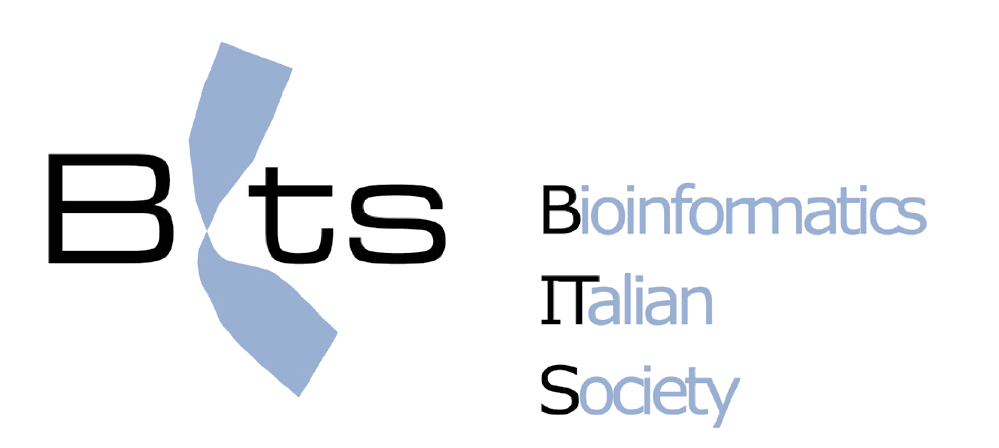

  

# Assemblea BITS 2026 Visualizations

Data analysis and visualization for the 2026 BITS assembly membership report.

This repository contains an R Markdown workflow used to clean membership data, derive demographic information, and generate charts for association trends and member analytics.

---

# Overview

The R Markdown workflow analyzes historical BITS membership data from an Excel spreadsheet and produces several visualizations related to:

- Membership growth over time
- New member demographics
- Median joining age
- Annual payment trends
- Membership retention
